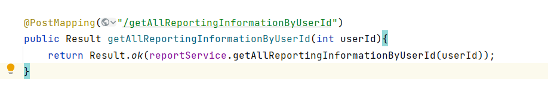

JavaEE课设&&软件工程课设

## 介绍

JavaEE&&软件工程课程设计之计算机智能学习交流平台

preschool-study

**第十七周答辩**

## 1.技术栈

**前端**

1. $PC$端。安卓/小程序待定
2. $Vue+axios/ajax$(待定)

**后端**

1. $Springboot+Mybatis/ SpringCloud$待定
2. 多环境部署
3. $SpringSecurity$安全相关，权限控制
4. $Docker$部署
5. 国际化(可考虑)
6. 数据源使用$druid$，防止$sql$注入以及实时监控
7. $Swagger$

**其他**

1. 域名备案
2. $Git$项目管理
3. 推荐算法

## 2.流程

1. 选定题目
   基于计算机专业学生的智能学习交流平台
   计算机智能学习交流平台
   
   www.preschool-study.xyz
   
2. 需求分析(根据软工所需待定)

3. 数据库创建

4. 前后端分离开发。安卓开发(待定)

## 3.补充说明

1. 开发环境有日志，生产环境无日志
2. 前端开发时，可以自己伪造$json$数据暂时自己请求以及使用

## 4.核心功能

 在与老师商议之后，基于计算机专业学生的智能学习交流平台(**后称为本平台**)基本敲定。

1. 本项目为计算机专业知识学习提供了一个知识体系的拓扑图，通过点击拓扑图的每一个节点可以跳转到对应的课程位置。类似下图

   

2. 在各个课程中，学生可以使用本项目分享学习笔记(支持$markdown$语法)，记录自己的踩坑过程。

3. 提供给学生一个互相交流的平台，可以提出自己的问题，同时也可以帮别人解答问题，分享自己的学习体会。

4. 本项目提供给了学生一些奖励制度，学生在该系统的活跃度越高，积分越高。

5. 用户上传的学习笔记或资源，用户可以自己选择免费公开或者收取一定的积分。

6. 个人界面：展示自己所上传的学习笔记，资源，所提出的问题等等信息。

7. 推荐算法 ：对于每一个用户，根据该用户常浏览的内容，推荐其他相关的内容。

8. 后续可选择的发展方向：

   - 题库，闯关做题，匹配机制
   - 积分可以按比率兑换人民币，其他详细商业方案
   - 排行榜功能，根据用户等级进行排行
   - 分类算法

 

## 5.课设记录以及任务安排

### 2021.9.14记录

 完成了核心功能的设计

### 2021.9.17记录

**开会要点记录**

`菜菜的修改`

1. 每一个课程板块内分为踩坑记录，笔记，提问。
2. 首页是突出企业文化的背景和文字设计->一个按钮【开启学习之旅】点击进入->一张学科拓扑图->点击（点击有动画效果）任意一个学科课程进入。
3. 关于回复的回复如何完成。
4. 首页有随便看看按钮，点击进入展示所有的学习笔记，踩坑记录，问题

### 2021.9.18记录

先进行数据库的建表，需要找时间开会商酌，以及软工课所述的模型选择。

### 2021.9.19记录

#### 数据库建表

2021.9.19创建

2021.9.20第一次修改

2021.9.22第二次修改

2021.10.8第三次修改：修改内容查看2021.10.8记录

2021.10.30第四次修改：修改内容查看2021.10.30记录

2021.11.20第五次修改：修改内容查看2021.11.20记录

2021.11.27第六次修改：修改内容查看2021.11.27记录

2021.11.28第七次修改：修改内容查看2021.11.28记录

2021.11.29第八次修改：修改内容查看2021.11.29记录

2021.12.01第九次修改：修改内容查看2021.12.01记录

2021.12.02第十次修改：修改内容查看2021.12.02记录

2021.12.09第十一次修改：合并了数据库，解决了矛盾冲突

2021.12.11第十二次修改：详细内容查看2021.12.11记录：CC币相关

2021.12.14第十三次修改：修改内容查看2021.12.14记录

2021.12.18第十四次修改：修改内容查看2021.12.18记录

```sql
/*
SQLyog Ultimate v12.14 (64 bit)
MySQL - 8.0.26 : Database - preschool
*********************************************************************
*/


/*!40101 SET NAMES utf8 */;

/*!40101 SET SQL_MODE=''*/;

/*!40014 SET @OLD_UNIQUE_CHECKS=@@UNIQUE_CHECKS, UNIQUE_CHECKS=0 */;
/*!40014 SET @OLD_FOREIGN_KEY_CHECKS=@@FOREIGN_KEY_CHECKS, FOREIGN_KEY_CHECKS=0 */;
/*!40101 SET @OLD_SQL_MODE=@@SQL_MODE, SQL_MODE='NO_AUTO_VALUE_ON_ZERO' */;
/*!40111 SET @OLD_SQL_NOTES=@@SQL_NOTES, SQL_NOTES=0 */;
CREATE DATABASE /*!32312 IF NOT EXISTS*/`preschool` /*!40100 DEFAULT CHARACTER SET utf8 */ /*!80016 DEFAULT ENCRYPTION='N' */;

USE `preschool`;

/*Table structure for table `column_self` */

DROP TABLE IF EXISTS `column_self`;

CREATE TABLE `column_self` (
  `id` int NOT NULL AUTO_INCREMENT COMMENT '专栏id',
  `name` varchar(100) DEFAULT NULL COMMENT '专栏名字',
  `user_id` int DEFAULT NULL COMMENT '用户id',
  PRIMARY KEY (`id`),
  KEY `user_id_column_fk` (`user_id`),
  CONSTRAINT `user_id_column_fk` FOREIGN KEY (`user_id`) REFERENCES `user` (`id`)
) ENGINE=InnoDB AUTO_INCREMENT=2 DEFAULT CHARSET=utf8mb3;

/*Data for the table `column_self` */

insert  into `column_self`(`id`,`name`,`user_id`) values 

(1,'测试',7);

/*Table structure for table `comment` */

DROP TABLE IF EXISTS `comment`;

CREATE TABLE `comment` (
  `id` int NOT NULL AUTO_INCREMENT COMMENT '评论id',
  `userIdFrom` int NOT NULL COMMENT '谁评论',
  `content` text CHARACTER SET utf8 COLLATE utf8_general_ci NOT NULL COMMENT '评论内容',
  `create_time` timestamp NULL DEFAULT CURRENT_TIMESTAMP ON UPDATE CURRENT_TIMESTAMP COMMENT '发表时间',
  `discussPostId` int DEFAULT NULL COMMENT '评论的博客的id',
  PRIMARY KEY (`id`),
  KEY `discuss_post_id_fk` (`discussPostId`),
  CONSTRAINT `discuss_post_id_fk` FOREIGN KEY (`discussPostId`) REFERENCES `discuss_post` (`id`)
) ENGINE=InnoDB AUTO_INCREMENT=4 DEFAULT CHARSET=utf8mb3;

/*Data for the table `comment` */

insert  into `comment`(`id`,`userIdFrom`,`content`,`create_time`,`discussPostId`) values 

(1,2,'测试评论','2021-11-27 10:05:53',2),

(2,3,'测试评论二','2021-11-27 10:06:10',3),

(3,7,'还可以噢',NULL,29);

/*Table structure for table `comment_reply` */

DROP TABLE IF EXISTS `comment_reply`;

CREATE TABLE `comment_reply` (
  `id` int NOT NULL AUTO_INCREMENT COMMENT '评论的回复的id',
  `user_id_from` int DEFAULT NULL COMMENT '谁回复',
  `user_id_to` int DEFAULT NULL COMMENT '回复谁',
  `content` text CHARACTER SET utf8 COLLATE utf8_general_ci COMMENT '回复的内容',
  `create_time` timestamp NULL DEFAULT CURRENT_TIMESTAMP ON UPDATE CURRENT_TIMESTAMP COMMENT '回复时间',
  `comment_id` int DEFAULT NULL COMMENT '所属评论的id',
  PRIMARY KEY (`id`),
  KEY `user_id_fk1` (`user_id_from`),
  KEY `user_id_fk2` (`user_id_to`),
  KEY `comment_id_fk` (`comment_id`),
  CONSTRAINT `comment_id_fk` FOREIGN KEY (`comment_id`) REFERENCES `comment` (`id`),
  CONSTRAINT `user_id_fk1` FOREIGN KEY (`user_id_from`) REFERENCES `user` (`id`),
  CONSTRAINT `user_id_fk2` FOREIGN KEY (`user_id_to`) REFERENCES `user` (`id`)
) ENGINE=InnoDB AUTO_INCREMENT=4 DEFAULT CHARSET=utf8mb3;

/*Data for the table `comment_reply` */

insert  into `comment_reply`(`id`,`user_id_from`,`user_id_to`,`content`,`create_time`,`comment_id`) values 

(1,3,1,'哈哈哈','2021-12-07 22:08:57',1),

(2,1,2,'啊哈哈哈哈\r\n','2021-12-07 22:09:16',2),

(3,7,7,'评论的评论','2021-12-17 19:06:58',3);

/*Table structure for table `discuss_post` */

DROP TABLE IF EXISTS `discuss_post`;

CREATE TABLE `discuss_post` (
  `id` int NOT NULL AUTO_INCREMENT COMMENT 'id',
  `user_id` int NOT NULL COMMENT '发表该博客的用户id',
  `title` varchar(100) CHARACTER SET utf8 COLLATE utf8_general_ci NOT NULL COMMENT '标题',
  `content` text CHARACTER SET utf8 COLLATE utf8_general_ci NOT NULL COMMENT '内容',
  `type` int DEFAULT '0' COMMENT '0-普通，1-置顶',
  `status` int DEFAULT '0' COMMENT '0-正常，1-精华，2-拉黑',
  `comment_count` int DEFAULT NULL COMMENT '评论数量',
  `up_count` int DEFAULT NULL COMMENT '点赞数量',
  `btype` int DEFAULT NULL COMMENT '0-笔记，1-踩坑记录，2-提问',
  `subject` int DEFAULT NULL COMMENT '学科类型id',
  `column_id` int DEFAULT NULL COMMENT '所对应的专栏id，非笔记类默认值为0，没有专栏为-1',
  `create_time` timestamp NULL DEFAULT CURRENT_TIMESTAMP ON UPDATE CURRENT_TIMESTAMP COMMENT '创建时间',
  `update_time` timestamp NULL DEFAULT CURRENT_TIMESTAMP ON UPDATE CURRENT_TIMESTAMP COMMENT '修改时间',
  `identify` int DEFAULT '1' COMMENT '0-审核通过，1-审核未通过',
  `url` varchar(200) DEFAULT NULL COMMENT '该博文的链接，方便后台核查举报信息',
  `isFree` int DEFAULT NULL COMMENT '1-免费，0-付费',
  `price` int DEFAULT NULL COMMENT '需要的cc币数量',
  PRIMARY KEY (`id`),
  KEY `user_id_fk` (`user_id`),
  KEY `subject_fk` (`subject`),
  CONSTRAINT `subject_fk` FOREIGN KEY (`subject`) REFERENCES `subject` (`id`),
  CONSTRAINT `user_id_fk` FOREIGN KEY (`user_id`) REFERENCES `user` (`id`)
) ENGINE=InnoDB AUTO_INCREMENT=32 DEFAULT CHARSET=utf8mb3;

/*Data for the table `discuss_post` */

insert  into `discuss_post`(`id`,`user_id`,`title`,`content`,`type`,`status`,`comment_count`,`up_count`,`btype`,`subject`,`column_id`,`create_time`,`update_time`,`identify`,`url`,`isFree`,`price`) values 

(2,2,'2222','2222',1,0,0,1,0,1,0,'2021-11-23 22:28:08','2021-11-23 22:28:08',0,NULL,NULL,NULL),

(3,3,'测试','我写的文章好啊',0,0,0,0,0,1,0,'2021-11-23 22:28:23','2021-11-23 22:28:23',0,NULL,NULL,NULL),

(4,3,'efs','fsrfrf',1,0,0,0,0,1,0,'2021-12-26 15:36:28','2021-12-29 15:36:30',1,NULL,NULL,NULL),

(5,3,'gg','gfthtyj',1,0,0,0,0,2,0,'2021-12-18 15:40:56','2021-12-25 15:40:58',1,NULL,NULL,NULL),

(6,3,'tr','ttttttttttttt',1,0,0,0,0,2,0,'2021-12-26 15:46:51','2021-12-27 15:46:53',1,NULL,NULL,NULL),

(7,3,'trt','1111111',1,0,0,0,0,3,0,'2021-12-30 15:52:38','2021-12-31 15:52:41',1,NULL,NULL,NULL),

(8,3,'55','11111111111',1,0,0,0,0,4,0,'2021-12-31 15:56:51','2021-12-31 15:56:54',1,NULL,NULL,NULL),

(9,4,'5','1111111111111111111111111',1,0,0,0,0,4,0,'2021-12-01 16:00:51','2021-12-03 16:00:55',1,NULL,NULL,NULL),

(10,4,'yyy','3333333333333',1,0,0,0,0,4,0,'2021-12-02 16:07:32','2021-12-02 16:07:34',1,NULL,NULL,NULL),

(11,4,'5','66666666666666666',1,0,0,0,0,5,0,'2021-12-02 16:08:43','2021-12-02 16:08:45',1,NULL,NULL,NULL),

(12,4,'6565','786888888888888888888888',1,0,0,0,0,6,0,'2021-12-02 16:10:40','2021-12-02 16:10:42',1,NULL,NULL,NULL),

(13,4,'1','22222222',1,0,0,0,0,7,0,'2021-12-02 16:13:33','2021-12-02 16:13:34',1,NULL,NULL,NULL),

(14,2,'11111','666666',1,0,0,0,0,8,0,'2021-12-02 16:15:32','2021-12-02 16:15:35',1,NULL,NULL,NULL),

(15,2,'1','00000',1,0,0,0,0,9,0,'2021-12-02 16:17:07','2021-12-02 16:17:09',1,NULL,NULL,NULL),

(16,2,'1111','111111111111111111111111111111111111',1,0,0,0,0,10,0,'2021-12-02 16:26:36','2021-12-02 16:26:37',1,NULL,NULL,NULL),

(17,2,'1111','11111111111111111111111111',1,0,0,0,0,10,0,'2021-12-02 16:27:49','2021-12-02 16:27:51',1,NULL,NULL,NULL),

(18,2,'111','11111111111111111',1,0,0,0,0,10,0,'2021-12-02 16:30:34','2021-12-02 16:30:36',1,NULL,NULL,NULL),

(19,2,'6666','ArrayList集合里存的是一个对象的引用',1,0,0,0,0,11,0,'2021-12-18 16:35:17','2021-12-18 16:35:20',1,NULL,NULL,NULL),

(20,2,'rrr','ttttttttttt',1,0,0,0,0,11,0,'2021-12-02 16:50:49','2021-12-02 16:50:51',1,NULL,NULL,NULL),

(22,2,'11','0',1,0,0,0,0,12,0,'2021-12-02 16:54:17','2021-12-02 16:54:19',1,NULL,NULL,NULL),

(24,4,'0000','000000000000000000',1,0,0,0,0,5,0,'2021-12-04 22:32:13','2021-12-04 22:32:13',0,NULL,0,0),

(25,4,'function和function()区别','1.function()代表的是被执行后函数返回的值。\r\n2.function代表的是函数自身，一般被作为参数传递给另一个函数。',1,0,0,0,0,5,0,'2021-12-04 23:45:59','2021-12-04 23:46:01',1,NULL,NULL,NULL),

(26,4,'111111','888888888',1,0,0,0,0,5,0,'2021-12-05 20:11:13','2021-12-05 20:11:15',1,NULL,NULL,NULL),

(27,4,'11111','333333',0,0,NULL,NULL,NULL,NULL,0,'2021-12-05 20:09:25','2021-12-05 20:09:25',1,NULL,NULL,NULL),

(28,8,'99999','99999999',1,0,0,0,0,6,0,'2021-10-05 21:16:52','2021-09-23 21:16:59',0,NULL,0,0),

(29,1,'感受一下','# 感觉有点奇怪诶\n## 哈哈哈\n### 啊啊啊啊啊啊啊啊啊啊啊',0,0,2,0,0,1,NULL,'2021-12-15 21:58:43','2021-12-15 21:58:43',0,NULL,1,0),

(31,7,'彭欢彭欢彭欢','# 彭欢好棒好棒\n## 哈哈哈哈哈\n### 啊啊啊啊',0,0,0,1,0,1,NULL,'2021-12-17 19:17:32','2021-12-17 19:17:32',0,NULL,0,30);

/*Table structure for table `email_verification` */

DROP TABLE IF EXISTS `email_verification`;

CREATE TABLE `email_verification` (
  `id` int NOT NULL AUTO_INCREMENT COMMENT '主键id',
  `email` varchar(100) DEFAULT NULL COMMENT '用户email',
  `code` varchar(20) DEFAULT NULL COMMENT '验证码',
  `createTime` timestamp NULL DEFAULT CURRENT_TIMESTAMP COMMENT '验证码获得的时间',
  PRIMARY KEY (`id`)
) ENGINE=InnoDB AUTO_INCREMENT=4 DEFAULT CHARSET=utf8mb3;

/*Data for the table `email_verification` */

insert  into `email_verification`(`id`,`email`,`code`,`createTime`) values 

(3,'2638826623@qq.com','52982021','2021-12-14 13:55:52');

/*Table structure for table `favorite_blog` */

DROP TABLE IF EXISTS `favorite_blog`;

CREATE TABLE `favorite_blog` (
  `id` int NOT NULL AUTO_INCREMENT COMMENT '收藏的博文表的主键',
  `discussPostId` int DEFAULT NULL COMMENT '收藏的博文ID',
  `userId` int DEFAULT NULL COMMENT '用户Id',
  PRIMARY KEY (`id`),
  KEY `favorite_blog_discuss_post_fk` (`discussPostId`),
  KEY `favorite_blog_user_fk` (`userId`),
  CONSTRAINT `favorite_blog_discuss_post_fk` FOREIGN KEY (`discussPostId`) REFERENCES `discuss_post` (`id`),
  CONSTRAINT `favorite_blog_user_fk` FOREIGN KEY (`userId`) REFERENCES `user` (`id`)
) ENGINE=InnoDB AUTO_INCREMENT=9 DEFAULT CHARSET=utf8mb3;

/*Data for the table `favorite_blog` */

insert  into `favorite_blog`(`id`,`discussPostId`,`userId`) values 

(1,2,2),

(2,3,3),

(3,2,1),

(4,2,3),

(5,2,4),

(6,3,5),

(7,3,6),

(8,2,8);

/*Table structure for table `feedback` */

DROP TABLE IF EXISTS `feedback`;

CREATE TABLE `feedback` (
  `id` int NOT NULL AUTO_INCREMENT COMMENT '反馈信息ID',
  `userId` int DEFAULT NULL COMMENT '反馈者ID',
  `feedbackFromContent` varchar(200) CHARACTER SET utf8 COLLATE utf8_general_ci DEFAULT NULL COMMENT '反馈内容(用户->后台)',
  `feedbackToContent` varchar(200) CHARACTER SET utf8 COLLATE utf8_general_ci DEFAULT NULL COMMENT '回馈内容(后台->用户)',
  `createTime` timestamp NULL DEFAULT CURRENT_TIMESTAMP ON UPDATE CURRENT_TIMESTAMP COMMENT '反馈时间',
  `state` int DEFAULT '0' COMMENT '状态（未读，已处理，删除三种状态）',
  PRIMARY KEY (`id`),
  KEY `feedback_user_fk` (`userId`),
  CONSTRAINT `feedback_user_fk` FOREIGN KEY (`userId`) REFERENCES `user` (`id`)
) ENGINE=InnoDB AUTO_INCREMENT=10 DEFAULT CHARSET=utf8mb3;

/*Data for the table `feedback` */

insert  into `feedback`(`id`,`userId`,`feedbackFromContent`,`feedbackToContent`,`createTime`,`state`) values 

(1,2,'请求快点开工，早点合并',NULL,'2021-11-29 01:44:06',0),

(2,3,'什么时候藏家',NULL,'2021-11-29 01:44:56',0),

(3,4,'可以不要这么冷漠嘛呜呜呜',NULL,'2021-11-29 01:46:11',1),

(9,3,'内容侵权','测试测试一下','2021-11-29 21:20:25',1);

/*Table structure for table `orders` */

DROP TABLE IF EXISTS `orders`;

CREATE TABLE `orders` (
  `id` int NOT NULL AUTO_INCREMENT COMMENT '订单Id',
  `userId` int DEFAULT NULL COMMENT '订单所有者的Id',
  `discussPostId` int DEFAULT NULL COMMENT '订单中所购买的博文的Id',
  `price` int DEFAULT NULL COMMENT '所花费的CC币数量',
  `createTime` timestamp NULL DEFAULT CURRENT_TIMESTAMP COMMENT '订单新增的时间',
  PRIMARY KEY (`id`)
) ENGINE=InnoDB AUTO_INCREMENT=2 DEFAULT CHARSET=utf8mb3;

/*Data for the table `orders` */

insert  into `orders`(`id`,`userId`,`discussPostId`,`price`,`createTime`) values 

(1,7,2,0,'2021-12-17 19:04:47');

/*Table structure for table `reading_num` */

DROP TABLE IF EXISTS `reading_num`;

CREATE TABLE `reading_num` (
  `id` int NOT NULL AUTO_INCREMENT COMMENT '阅读量表主键Id',
  `userId` int DEFAULT NULL COMMENT '用户Id',
  `num` int DEFAULT NULL COMMENT '阅读量',
  PRIMARY KEY (`id`),
  KEY `ReadingNumUser` (`userId`),
  CONSTRAINT `ReadingNumUser` FOREIGN KEY (`userId`) REFERENCES `user` (`id`)
) ENGINE=InnoDB AUTO_INCREMENT=3 DEFAULT CHARSET=utf8mb3;

/*Data for the table `reading_num` */

/*Table structure for table `reporting_information` */

DROP TABLE IF EXISTS `reporting_information`;

CREATE TABLE `reporting_information` (
  `id` int NOT NULL AUTO_INCREMENT COMMENT '举报信息ID',
  `reportIdFrom` int DEFAULT NULL COMMENT '举报人的ID',
  `reportIdTo` int DEFAULT NULL COMMENT '被举报的博文ID',
  `reportReason` varchar(200) CHARACTER SET utf8 COLLATE utf8_german2_ci DEFAULT NULL COMMENT '举报原因',
  `createTime` timestamp NULL DEFAULT CURRENT_TIMESTAMP COMMENT '举报时间',
  `reportInformation` varchar(2000) CHARACTER SET utf8 COLLATE utf8_german2_ci DEFAULT NULL COMMENT '举报的补充信息',
  `processStatus` int DEFAULT '0' COMMENT '是否处理，1-已处理，0-未处理',
  PRIMARY KEY (`id`),
  KEY `user_id_reportIdFrom_fk` (`reportIdFrom`),
  KEY `discuss_post_reportIdTofk` (`reportIdTo`),
  CONSTRAINT `discuss_post_reportIdTofk` FOREIGN KEY (`reportIdTo`) REFERENCES `discuss_post` (`id`),
  CONSTRAINT `user_id_reportIdFrom_fk` FOREIGN KEY (`reportIdFrom`) REFERENCES `user` (`id`)
) ENGINE=InnoDB AUTO_INCREMENT=3 DEFAULT CHARSET=utf8mb3 COLLATE=utf8_german2_ci;

/*Data for the table `reporting_information` */

insert  into `reporting_information`(`id`,`reportIdFrom`,`reportIdTo`,`reportReason`,`createTime`,`reportInformation`,`processStatus`) values 

(1,2,2,'内容抄袭','2021-11-28 20:42:02','该博文内容和a碟的博客严重相似，请求处理',0),

(2,3,2,'内容侵权','2021-11-28 20:42:45','该博文严重侵权，快快处理',1);

/*Table structure for table `subject` */

DROP TABLE IF EXISTS `subject`;

CREATE TABLE `subject` (
  `id` int NOT NULL COMMENT '学科类型id',
  `name` varchar(100) NOT NULL COMMENT '学科名称',
  `category` int DEFAULT NULL COMMENT '所属大类',
  PRIMARY KEY (`id`)
) ENGINE=InnoDB DEFAULT CHARSET=utf8mb3;

/*Data for the table `subject` */

insert  into `subject`(`id`,`name`,`category`) values 

(1,'高等数学',1),

(2,'离散数学',1),

(3,'线性代数',1),

(4,'概率论',1),

(5,'JAVAEE',2),

(6,'VUE',2),

(7,'WEB',2),

(8,'JS',2),

(9,'计算机组成原理',3),

(10,'微型计算机原理',3),

(11,'嵌入式原理',3),

(12,'Linux',3);

/*Table structure for table `support_blog` */

DROP TABLE IF EXISTS `support_blog`;

CREATE TABLE `support_blog` (
  `id` int NOT NULL AUTO_INCREMENT COMMENT '点赞的博文表的主键',
  `discussPostId` int DEFAULT NULL COMMENT '点赞的博文ID',
  `userId` int DEFAULT NULL COMMENT '用户Id',
  PRIMARY KEY (`id`),
  KEY `support_blog_discuss_post_fk` (`discussPostId`),
  KEY `support_blog_user_fk` (`userId`),
  CONSTRAINT `support_blog_discuss_post_fk` FOREIGN KEY (`discussPostId`) REFERENCES `discuss_post` (`id`),
  CONSTRAINT `support_blog_user_fk` FOREIGN KEY (`userId`) REFERENCES `user` (`id`)
) ENGINE=InnoDB AUTO_INCREMENT=14 DEFAULT CHARSET=utf8mb3;

/*Data for the table `support_blog` */

insert  into `support_blog`(`id`,`discussPostId`,`userId`) values 

(1,2,1),

(2,3,2),

(3,2,3),

(4,3,4),

(5,2,5),

(6,3,6),

(7,2,8),

(8,3,1),

(9,2,1),

(10,3,2),

(11,2,2),

(13,31,7);

/*Table structure for table `user` */

DROP TABLE IF EXISTS `user`;

CREATE TABLE `user` (
  `id` int NOT NULL AUTO_INCREMENT COMMENT '用户id',
  `password` varchar(500) CHARACTER SET utf8 COLLATE utf8_general_ci NOT NULL COMMENT '用户密码',
  `email` varchar(100) DEFAULT NULL COMMENT '用户邮箱',
  `username` varchar(50) NOT NULL COMMENT '用户昵称',
  `type` int NOT NULL COMMENT '用户类型，0-普通用户; 1-管理员;',
  `birthday` varchar(100) DEFAULT NULL COMMENT '用户生日',
  `phonenumber` varchar(50) DEFAULT NULL COMMENT '用户手机号',
  `sex` int DEFAULT NULL COMMENT '用户性别，0-男，1-女',
  `signature` varchar(100) DEFAULT NULL COMMENT '个性签名',
  `portrait_id` int DEFAULT NULL COMMENT '用户头像id',
  `createTime` timestamp NULL DEFAULT CURRENT_TIMESTAMP ON UPDATE CURRENT_TIMESTAMP COMMENT '用户注册时间',
  `updateTime` timestamp NULL DEFAULT CURRENT_TIMESTAMP ON UPDATE CURRENT_TIMESTAMP COMMENT '用户更新时间',
  `status` int NOT NULL COMMENT '用户账号状态，0-正常，1-冻结',
  `place` varchar(50) DEFAULT NULL COMMENT '用户所在地',
  `ccNum` int DEFAULT '0' COMMENT 'cc币数量',
  `url` varchar(500) DEFAULT 'http://r3zvcgduw.hn-bkt.clouddn.com/%298F9D~LDO7VTV%5D_%40U%60D%5BGK5.png' COMMENT '用户头像',
  PRIMARY KEY (`id`),
  KEY `portrait_id_fk` (`portrait_id`),
  CONSTRAINT `portrait_id_fk` FOREIGN KEY (`portrait_id`) REFERENCES `user_portrait` (`id`)
) ENGINE=InnoDB AUTO_INCREMENT=985669638 DEFAULT CHARSET=utf8mb3;

/*Data for the table `user` */

insert  into `user`(`id`,`password`,`email`,`username`,`type`,`birthday`,`phonenumber`,`sex`,`signature`,`portrait_id`,`createTime`,`updateTime`,`status`,`place`,`ccNum`,`url`) values 

(1,'EA983C0D57E04E8D214F63E1228CBF15',NULL,'e碟',0,NULL,'201901020241',0,NULL,0,'2021-12-15 22:01:36','2021-12-15 22:01:36',1,'湖南',0,'http://r3zvcgduw.hn-bkt.clouddn.com/%298F9D~LDO7VTV%5D_%40U%60D%5BGK5.png'),

(2,'8574C4889B90706FE1CAAEAC260B188A','993204079@qq.com','a碟',0,NULL,'33333',0,NULL,0,'2021-12-09 22:42:41','2021-12-09 22:42:41',0,'湖南',0,'http://r3zvcgduw.hn-bkt.clouddn.com/%298F9D~LDO7VTV%5D_%40U%60D%5BGK5.png'),

(3,'8574C4889B90706FE1CAAEAC260B188A','2098656227@qq.com','b碟',0,NULL,'22222',0,NULL,0,'2021-12-09 22:42:48','2021-12-09 22:42:48',1,'浙江',1,'http://r3zvcgduw.hn-bkt.clouddn.com/%298F9D~LDO7VTV%5D_%40U%60D%5BGK5.png'),

(4,'8574C4889B90706FE1CAAEAC260B188A','2638826623@qq.com','hh',0,NULL,'11111',0,NULL,0,'2021-12-15 22:01:39','2021-12-15 22:01:39',1,'浙江',0,'http://r3zvcgduw.hn-bkt.clouddn.com/%298F9D~LDO7VTV%5D_%40U%60D%5BGK5.png'),

(5,'F59BD65F7EDAFB087A81D4DCA06C4910',NULL,'123456',0,NULL,'123456',0,NULL,0,'2021-12-15 21:58:08','2021-12-15 21:58:08',0,'广东',0,'http://r3zvcgduw.hn-bkt.clouddn.com/%298F9D~LDO7VTV%5D_%40U%60D%5BGK5.png'),

(6,'6456C7FAC445F3C1C3E7F4405159D80E',NULL,'00',0,NULL,'000000',0,NULL,0,'2021-12-15 22:01:41','2021-12-15 22:01:41',1,'北京',0,'http://r3zvcgduw.hn-bkt.clouddn.com/%298F9D~LDO7VTV%5D_%40U%60D%5BGK5.png'),

(7,'8574C4889B90706FE1CAAEAC260B188A','993204079@qq.com','a碟',0,'','13975580513',0,'123456',0,'2021-12-18 16:55:57','2021-12-18 16:55:57',1,'上海',2,'http://r3zvcgduw.hn-bkt.clouddn.com/8ee2a6f5-4895-4ccf-81ef-add7b9503d44'),

(8,'950A4152C2B4AA3AD78BDD6B366CC179','1532743414@qq.com','cc',0,NULL,'312312312',0,NULL,0,'2021-12-14 02:09:47','2021-12-14 02:09:47',0,'浙江',0,'http://r3zvcgduw.hn-bkt.clouddn.com/%298F9D~LDO7VTV%5D_%40U%60D%5BGK5.png');

/*Table structure for table `user_portrait` */

DROP TABLE IF EXISTS `user_portrait`;

CREATE TABLE `user_portrait` (
  `id` int NOT NULL COMMENT '头像id，使用java UUid获得',
  `url` varchar(200) NOT NULL COMMENT '头像图片地址',
  PRIMARY KEY (`id`)
) ENGINE=InnoDB DEFAULT CHARSET=utf8mb3;

/*Data for the table `user_portrait` */

insert  into `user_portrait`(`id`,`url`) values 

(0,'test');

/*!40101 SET SQL_MODE=@OLD_SQL_MODE */;
/*!40014 SET FOREIGN_KEY_CHECKS=@OLD_FOREIGN_KEY_CHECKS */;
/*!40014 SET UNIQUE_CHECKS=@OLD_UNIQUE_CHECKS */;
/*!40111 SET SQL_NOTES=@OLD_SQL_NOTES */;
```

### 2021.9.20记录

**开会记录**

1. **计算机专业学科如何分类？**
2. 对于博客下面的回复，我们只需要清楚地知道是**评论还是评论的回复**即可。对于如何渲染评论和评论的回复，按照时间排序即可，也需要记录是谁回复了谁。所以**需要新建一个关于评论的回复的表**。
3. 敲定模型：迭代模型
4. 暂时都使用master分支
5. 对数据库进行了少量修改，删除了`useraccount`字段
6. 对于discuss_post表中的subject类型类应该是不需要更改的，每一个博文内容都是属于一个小的类别。对于每一个大类的设定，需要我们提前做好，在subject中加一个字段`category`来确定每一种学科属于哪一个类型。

综上，我们已经完成：建表，核心功能点分析

**暂时的本周任务**

- 彭欢：前端开始设计
- 蔡思涵：实体类创建（已创建）
- 欧阳亨杰：学习推荐算法

下次开会（尽快），需要对前后端交互的各个点进行详细规定，然后正式开始开发。

### 2021.9.22记录

写实体类过程中，把comment表中的user_id_to  字段删除了

今天开会中讲述了git的分支的作用，在后续开发中，组员使用分支上传项目，如有冲突，组长解决冲突并进行合并。

#### 新增需求

1.菜菜需求1：点赞花样

2.菜菜需求2：历史浏览记录


#### 功能记录

所有的变量名参考数据库

1.登陆：前端传String类型的账号(手机号)和密码。 要不要做权限高的人？ `/login`

2.注册：前端传String类型的账号(手机号)和密码。 前端判断是否符合要求，(补充：前端传手机号，发送请求 `/checkPhone` ,看看是不是此手机已经被注册)。 `/register`

3.拓扑图：前端确定每个点的value，value就是该学科的id。前端自己画图。 

4.拓扑图进入：前端传递int类型的学科类型id。后端接收数据之后，默认通过该id和btype=0去检索笔记。后端传递所有的对应的discuss_post数据。 `/discuss/showPosts`

5.内容切换：前端页面可以对当前的板块内容进行切换，0-笔记，1-踩坑记录，2-提问切换。前端传递学科id和板块分类id(btype)。

`/discuss/showPosts`

6.发表：点击发表按钮，根据当前所在的页面，默认的发表首选项就是当前所在页面的类型（比如当前所在笔记，默认就是发表笔记，但是也提供一个可以切换的按钮）。

  前端传title，content，btype，subject，column_id。 user_id(后端在Session域里面找),create_time后端设置，后端默认对type，status，comment_count，up_num置0。 `/discuss/addPost`
  用户点击发表，前端发送请求（添加一条博客），随即发送显示博客的请求 `/discuss/showPosts`

7.查看某条博文，前端传博文id，后端根据id查到该条博客数据返回给前端 ` /discuss/showOnePost`

8.修改方面：对于笔记，踩坑记录，提问内容下博文的修改。点击修改，前端跳到修改页面，发送第7条一样的请求，将数据全部展示出来，点击修改(修改页面的修改内容有title,content,type,status)，前端发送请求传id和内容（title,content,type,status，up_count,comment_count）给后端，后端根据id修改所有的内容。
用户评论和点赞,前端传id,后端需要对数量+1，修改博客数据。 `/discuss/updateOnepost` ,`/discuss/up` ,`/discuss/comment`

9.删除某一条博客，`discuss/deleteOnePost`

10.评论和回复（其展示，后端均按时间排序传给前端）：

**点击第一种（评论）按钮**，`/discuss/comment`

前端发送请求，传递content  ,   discuss_post_id  ,后端设置评论时间(create_time)，以及谁评论（user_id_from），对评论数+1

接着发送请求，查询该条博文下所有评论 `/discuss/showComments`，每条评论里发请求查询该条评论下所有回复 `/discuss/showReplies`

**点击第二种（评论的回复）按钮**，`/discuss/reply`

前端发送请求，传递content  ,   comment_id ,后端设置评论时间(create_time)，以及谁回复（user_id_from），对评论数+1,回复谁null

接着发送请求，查询该条博文下所有评论，每条评论里发请求查询该条评论下所有回复

**点击第三种（评论的回复的回复）按钮**，`/discuss/reply`

前端发送请求传递回复谁（user_id_to）,回复的内容(content),回复所属评论的id(comment_id),后端设置回复时间(create_time)，以及谁回复（user_id_from）   ，对评论数+1
接着发送请求，查询该条博文下所有评论，每条评论里发请求查询该条评论下所有回复


前端设置三种  按钮


10.首页有随便看看按钮,点击前端发送请求且btype=0，默认进入查看笔记  `/discuss/showAllPosts` 点击切换同该请求

11.完成上述功能后再进行后续的补充......（关于对评论的回复，删除笔记/踩坑记录/提问，等等）


#### 近1-2周主要任务

- 欧阳亨杰：学习推荐算法，可据实际情况帮助完成上述功能的前后端搭建
- 蔡思涵：关于上述功能记录的后端搭建，继续学习后端知识
- 彭欢：关于上述功能记录的前端设计，继续学习前端知识


### 2021.9.26记录

1.学科如何分类，已拖欠很久。

关于分类也许可以不用分成几种大类，直接按照拓扑结构划分成很多条线即可。

如果多条线相交于同一点，可以让用户自行选择点击哪一条线。

所以  数据库修改

2.关于git

#### git基本概念

- 工作区：仓库的目录。工作区是独立于各个分支的。
- 暂存区：数据暂时存放的区域，类似于工作区写入版本库前的缓存区。暂存区是独立于各个分支的。
- 版本库：存放所有已经提交到本地仓库的代码版本
- 版本结构：树结构，树中每个节点代表一个代码版本

#### git常用指令

`git config --global user.name xxx`：设置全局用户名，信息记录在~/.gitconfig文件中

`git config --global user.email xxx@xxx.com`：设置全局邮箱地址，信息记录在~/.gitconfig文件中

`git init`：将当前目录配置成git仓库，信息记录在隐藏的.git文件夹中

`git add XX`：将XX文件添加到暂存区

`git add .`：将所有待加入暂存区的文件加入暂存区

`git rm --cached XX`：将文件从仓库索引目录中删掉

`git commit -m` "给自己看的备注信息"：将暂存区的内容提交到当前分支

`git status`：查看仓库状态

`git diff XX`：查看XX文件相对于暂存区修改了哪些内容

`git log`：查看当前分支的所有版本

`git reflog`：查看HEAD指针的移动历史（包括被回滚的版本）

`git reset --hard HEAD^` 或 `git reset --hard HEAD~`：将代码库回滚到上一个版本

`git reset --hard HEAD^^`：往上回滚两次，以此类推

`git reset --hard HEAD~100`：往上回滚100个版本

`git reset --hard` 版本号：回滚到某一特定版本

`git checkout — XX`或`git restore XX`：将XX文件尚未加入暂存区的修改全部撤销

`git remote add origin git@git.acwing.com:xxx/XXX.git`：将本地仓库关联到远程仓库

`git push -u` (第一次需要-u以后不需要)：将当前分支推送到远程仓库

`git push origin branch_name`：将本地的某个分支推送到远程仓库

`git clone git@git.acwing.com:xxx/XXX.git`：将远程仓库XXX下载到当前目录下

`git checkout -b branch_name`：创建并切换到branch_name这个分支

`git branch`：查看所有分支和当前所处分支

`git checkout branch_name`：切换到branch_name这个分支

`git merge branch_name`：将分支branch_name合并到当前分支上

`git branch -d branch_name`：删除本地仓库的branch_name分支

`git branch branch_name`：创建新分支

`git push --set-upstream origin branch_name`：设置本地的branch_name分支对应远程仓库的branch_name分支

`git push -d origin branch_name`：删除远程仓库的branch_name分支

`git pull`：将远程仓库的当前分支与本地仓库的当前分支合并

`git pull origin branch_name`：将远程仓库的branch_name分支与本地仓库的当前分支合并

`git branch --set-upstream-to=origin/branch_name1 branch_name2`：将远程的branch_name1分支与本地的branch_name2分支对应

`git checkout -t origin/branch_name` 将远程的branch_name分支拉取到本地

`git stash`：将工作区和暂存区中尚未提交的修改存入栈中

`git stash apply`：将栈顶存储的修改恢复到当前分支，但不删除栈顶元素

`git stash drop`：删除栈顶存储的修改

`git stash pop`：将栈顶存储的修改恢复到当前分支，同时删除栈顶元素

`git stash list`：查看栈中所有元素

一般的上传操作：

`git add .`

`git commit -m "内容" ` 

`git push`

对于本地新创建的分支上传

`git add .`

`git commit -m "内容" ` 

`git push`

三步之后，会有提示使用`git push --set-upstream origin branch_name`。将远程仓库的branch_name分支与本地仓库的当前分支合并

关于各个人版本操作系统不同而导致的代码不同的部分，每次上传不要选择这个部分上传。

### 2021.9.28记录

1.bug记录

- @mapper的注解使用的包是`import org.apache.ibatis.annotations.Mapper;`，之前所导入的包为`import org.mapstruct.Mapper;`

- 没有导入mybatis整合springboot的包，导致yml中的配置扫描xml文件失效

  ```xml
  <dependency>
      <groupId>org.mybatis.spring.boot</groupId>
      <artifactId>mybatis-spring-boot-starter</artifactId>
      <version>2.1.4</version>
  </dependency>
  ```

2.下次开会需要确定的内容：

- 国庆任务安排√
- 学科分类问题√
- swagger讲解√
- 再次确定前后端的开发流程
- 探讨人生
- 匹配机制


### 2021.9.29记录

**1.开会记录**

- 1.确定近半个月的分工，具体分工和任务需求在第二点细分。

- 2.学科分类

  公共基础课我们不考虑在本系统中

  专业基础课：C语言+Java等语言基础课+算法+计算机组成原理+计算机操作系统

  专业基础课后还有业务方面：设计模式，软件工程之类

  在这之后分成四大类

  1.技术：JavaWeb(html,css,js,servlet等包括其中)$\rightarrow$JavaEE(这一块可以细分成各种框架)+数据库+Android+微信小程序+前端各种框架(可以细分)

  2.网络：微机原理与接口技术 ，计算机网络，网络安全，信息安全技术

  3.大数据：Linux$\rightarrow$人工智能+数据挖掘 +云计算与大数据技术 

  4.硬件方面

- 3.讲解了swagger的用法，后端人员在开发时对controller层和pojo实体类需要进行标注，方便前端进行查阅

- 4.讲解了druid的监控功能

- 5.**一个新的功能创新点**：匹配机制，实现两个用户实时对战进行闯关的功能，需要配合后续的题库闯关功能使用

- 6.确定整个项目的工作，由彭欢先行进行前端的编码，后端在完成后端基本的增删改查操作之后，可按照需求对前端进行帮助


**2.近半个月的任务**

彭欢：前端优先完成**学习笔记，踩坑记录，问题页面**的制作

蔡思涵，欧阳亨杰：后端完成该页面的增删改查操作，并且前后端交互成功。

欧阳亨杰：学习微服务架构和算法


### 2021.10.2记录

1.80端口写请求不用带上端口号，否则需要使用nginx反向代理

2.所有请求，如果有参数，且参数设计用户个人私密信息（如密码），则使用post请求，否则都是用get请求，后端代码中不使用`@RequestMapping`

3.swagger的controller层更新了部分代码


### 2021.10.4记录

1.bug记录：

- 数据库user表中portrait_id有外码约束，所以需要在user_portrait中设置一个默认的用户头像，id为0
- 获取当前时间有误，更改配置文件设置mysql数据库解决


### 2021.10.6记录

1.在提交代码的时候，所有的由编译产生的文件，不需要提交到gitee上面，例如后端项目中生成的target文件夹，.idea的idea配置文件文件夹

2.**下次开会主要内容：**

- 前端有关的问题(具体如何开始，做成什么样子等)
- 后端新的任务(不分页，刷新，每次返回若干的数据量，后端同样还是分页的操作)
- 合并分支相关
- 需求重新汇总整理一次
- **国庆任务完成情况**
- 如何回到以前的版本
- 在完成了9.22日的功能点之后，上传第一个版本version1.0
- 探讨人生
- 想到再补


### 2021.10.8记录

1.开会记录

#### 功能记录

个人界面

- 新建一个表，用于处理个人文章分类，专栏表，在表中添加字段column_self.
  三个字段，用户id（外码约束），专栏名字，专栏id（主键）


- 展示个人所有文章 `/person/showAllPosts`
  根据前端传来的btype (笔记、踩坑记录、提问)展示个人发表的某博文类型下的所有博文  `/person/showSomePosts`
  
- 清空个人所有文章  `/person/clearAll`
  
  清空某一博文类型下所有文章`/person/clearSome`
  
- 展示个人专栏   获得个人创建的所有专栏  `/person/column/showAll`
  点击某一专栏   前端传专栏column_id  后端获取该专栏下的博文  `/person/column/showPosts`      
  
- 新增，修改专栏     `/person/column/add     ` `/person/column/update`

-   删除专栏，分3种情况，

                      仅删除专栏   `/person/column/delColumn`
        
                      仅清空该专栏下所有博文   `/person/column/delPosts`
        
                      删除专栏也删除博文 `/person/column/delBoth`                                                                                                                                                                                                                                                                                                                                                                                                                                                                                                                                                                                                                                                                                                                                                                       

- 根据用户id查询用户个人信息 `/person/information`

- 更新个人信息   `/person/update`

- 把一条笔记类型的博文添加至某专栏 `/discuss/addToColumn`

**前端相关**：

两周完成9.22讨论的内容


### 2021.10.11记录

**开会任务**

1.软工作业分析


**开会记录**

1.如何估算软件的效益，计算投资回收期？

2.有关竞品分析的问题


**分工：**

欧阳亨杰：经济可行性

彭欢：技术可行性

蔡思涵：社会可行性


周五晚上前完成该任务

**竞品分析在上述内容完成之后再继续安排**


### 2021.10.12记录

基于2021.10.11开会中留下的两个问题，向老师提问后，解决方法整理如下：

- 对于软件效益和成本，我们所需要做到的就是估算，对于效益，也包括了减少本项目的成本。如有经济方面的具体钱的数量不好计算，可以不做详细的描述。
- 对于相关竞品分析，我们不需要做到如老师所给出的网站中，分析的那么面面俱到，仅需要简要分析其他我们所选的竞品的部分内容即可（可再商议）。

#### 文档字体格式规定

- 文件以 A4 纸张格式。 

- 版面设定为直向纸张，边界为上 2cm、下 2cm、左 2cm、右 2cm、装 订线 1cm。 

- 字体统一用标准楷体，字号小四，单倍行距，与前后段距离 0.5 行。

- 1号标题：楷体二号；2号标题：楷体小二；3号标题：楷体三号；4号标题：楷体小三

  

  可在此处更改样式，各种标题选择也需要点击这个，最后生成目录能够一键生成。

- 对于图片/表格，需要在每一个图片/表格下方标注图x-y xxx，或者表x-y xxx

- 每一个标题序号的内容空一格再写内容，比如 6 经济可行性分析。


### 2021.10.15记录

**2021.10.11的分工中需要完成的内容早点完成发出来。**

可行性分析还需完成如下内容：

**1.竞品分析相关**

相关竞品：CSDN，博客园，掘金。

分析的几个**要点**：

1. 选择原因

2. 竞品的基本信息

3. 百度指数(以及所选的几个竞品之间的百度指数对比)https://index.baidu.com/v2/index.html#/

4. 战略层分析

   1. 产品定位
   2. 业务分析
   3. 商业模式

   结论

5. 用户分析（百度指数可查）

   1. 用户性别比例

   2. 用户年龄构成

   3. 用户地域分布

   4. 用户定位

      类似这种

      

   5. 用户需求

      

6. 范围层分析，即分析该竞品的产品功能

7. 总结，针对上述竞品，我们的优势(只针对计算机学生，范围限定，更加适合计算机学生在此交流；学生之间分享学习笔记，bug交流，比其他的大型论坛平台来说，具有其独特的专用性；提供给大学生一个学科拓扑图，描绘出大学的学习线路......编一编)

上述要点的参考链接

- http://www.woshipm.com/evaluating/4478094.html
- http://www.woshipm.com/evaluating/4812192.html

对上述的几个点，自己先选择**1个以上**的竞品进行分析，不一定对上述点都进行分析，但尽量多覆盖上述的点，自由发挥。


**2.对现有系统的分析**

考虑到竞品分析和本内容有相似之处，所以参照书上以及pdf资料的内容先自行想好或者记录。开会的时候直接完成。

暂定于2021.10.16晚上开会，如果当天下午对于上述几点的完成情况不是很高的话，就改为第二天下午开会。

上述两点内容在开会之前**完成并且发出**（最好早点噢），在互相看完大家的分析之后，该天晚上开会(暂定7点)进行最后的总结和汇总。


### 2021.10.30记录

修改内容：

1. 引入了mybatis-plus，自动生成了其他类（除了已经写完的类）的controller，service，mapper
2. 删去了所有的id手动设置，改为自动设置。
3. 删去了所有的时间设置，改为mapper-plus自动填充
4. 基于第三点，所有添加操作，改为了xxx.insert(xxx)（原有的添加操作的代码可以不需要了）。这样才能自动填充。
5. 给部分表添加了create_time,update_time字段。
6. 测试了用户添加和博文添加，暂时无误。


### 2021.11.02记录

下次开会的内容(**暂定周三开会**)：

1. 软件工程-需求分析 讨论.数据流图+ER图+数据字典解释+层次方框图+可选状态转换图

   

   

   - 数据流图,ER图,层次方框图,数据字典分工负责

     - 数据流图相关

       

       

       

       

       

       

       

     - 数据流图应该是最复杂的,负责其他图的两人可适当多完成一些别的任务

   - 其他的要点,大多都是可以自己自由发挥的内容,**可在本次开会时进行分工**

   - 在分工完成之后,**下周二提交第一个版本**,可以提交版本前开会进行整合

2. 检查上次的任务完成情况，**尽快推出第一个版本**。

3. 后续的分工，完成速度可以**适当加快**，项目重心可以往前端偏移。

4. Mybatis-plus 可根据时间,弹性调整往后推迟


### 2021.11.03记录

**1.分工**

**欧阳亨杰：** 数据流图+数据字典解释

**彭欢：** ER图，1，2，4点

**蔡思涵： ** 层次方框图，5，6，7点

**星期二之前完成**

**2.功能创新点记录**

直播功能

**3.下次开会讲Mybatis-plus**


### 2021.11.12记录

**开会记录**

1. 新增功能点：博文删除后可以恢复，所以添加回收站功能，需要对数据库更新，增加deleted字段，实现逻辑删除
2. 讲完了mybatis-plus
3. 2021.11.13开会需要确定后续的主要任务，加快进度，==12月前推出第一个版本==
4. 需要对仓库结构修改，前端，后端......
5. **以后每天有时间都能坐在一起，做项目**


### 2021.11.13记录

**开会记录**

1. 浏览历史功能，需要添加一张浏览历史表，来记录相应的信息。
2. 前端！


### 2021.11.14记录

1. 第十七周答辩，本周为第十周最后一天，还有**六周**项目时间。
2. 对**剩下六周**时间进行规划，所定的任务，所有人除了特殊情况，**一定要在规定时间完成**。
   - 前两周的任务：**(一定要在规定时间完成，如有极特殊情况可延长)**
     - 彭欢：博文界面，个人界面完成（包括且不限于基本的样式完善，最好能够美化）
     - 欧阳亨杰，蔡思涵：后台管理端基本完成（包括且不限于应有的数据的展示，数据可视化）
   - 后续任务：如排行榜，积分制度，主页的知识体系拓扑图等都是必要完成的。在此基础上，推荐算法，闯关功能，直播功能待定。**在两周之后对该部分内容开会讨论**。
   


### 2021.11.15

#### 后台管理系统功能记录

具体的请求URL见代码，下面的仅供参考

1.用户管理

用户搜索

用户查看 `/admin/user/showAll`

用户冻结 `/admin/user/freeze`

用户注销 `/admin/user/logout`


2.学科管理

学科搜索

增 `/admin/subject/add`

删 `/admin/subject/delete`

 改 `/admin/subject/update`

查看  `/admin/subject/showAll`


3.博文管理

博文搜索

删 `/admin/discuss/delete`

查看  `/admin/discuss/showAll`


4.回复管理

回复搜索（搜寻非法言论）

删 `/admin/reply/delete`

查看  `/admin/reply/showAll`


5.评论管理

评论搜索（搜寻非法言论）

删 `/admin/comment/delete`

查看  `/admin/comment/showAll`


### 2021.11.16记录

目前后台想到的有两种解决方案：

1.使用renren生成后台代码，但同时，与后台相关的后端接口代码需要重新自动生成一份，相当于出现两个后端项目。而且，需要对数据库进行修改，因为生成代码的模板中，需要数据库存储相关配置信息。

- 了解到renren在生成vue的代码时，表格的格式需要手动微调


- 而且在需要添加其他的板块时，动态路由只能添加到系统管理栏下（不在这下面需要研究代码），不太方便

2.继续使用前一天找到的模板，主要解决的是**未定义的问题**，后续的操作也需要自己手写，但不需要修改数据库。


### 2021.11.18记录

**关于前后台的一些记录**

1. 用户发表博文后，后台接收到数据，开始审核，会在后台的未审核表中出现，管理员可对未审核的文章，设置为审核通过的文章，或不允许发布，给出理由，理由需要再发送给用户，然后打回。所以博文需要多个状态字段（未审核，审核通过，审核不通过）
2. 审核通过的文章，也可以查看信息，变成审核不通过的文章，并提醒用户。


### 2021.11.19记录

菜菜：继续学习echarts,周六周天争取看40个视频


### 2021.11.20记录

1. 数据库再次调整，考虑到需要对用户进行冻结或者解冻的操作，需要给用户表中加一个字段`status`进行控制。
2. 考虑到需要对文章进行审核，所以需要对文章也加入一个字段`identify`.
3. 对后端的实体类也做了同样的修改
4. 前端所需可视化界面涉及的echarts学习还在进行中


### 2021.11.22记录

1. 还是考虑增加Result工具类，这样返回给前端的信息格式更加的规范，正在修改中......
2. 后台实现了用户表和博文表的模糊查询和修改信息，分页查询功能。


### 2021.11.25记录

1. 下次开会讨论内容 **（暂定2021.11.25 周四 下午开会）** 
   1. 目前后端存在一些问题：在做后台时，写了一些冗余的请求；而且，在后续更改数据库的过程中，之前的一些请求都没有同步修改，如何处理该问题。
   2. 关于后台，还需要什么功能？
   3. 大家的进展情况
2. 开会记录
   1. 后台增加举报的信息记录，处理举报信息
      1. 用户举报表
      2. 举报信息表
   2. 后台新增对所有表的管理


### 2021.11.26记录

1. 将图表集成在后台中的时间？
2. 前后端交互的时间？

### 2021.11.27记录

1. 考虑图床搭建

2. 针对举报信息的收集

   1. 举报信息表的字段

      - 举报信息ID

      - 举报人的ID
      - 被举报的博文的ID
      - 举报原因
      - 举报时间
      - 举报的其他补充信息
      - 是否处理（处理的方式，处理结果可以再次发送给举报者，作为一个反馈，后续可考虑增加反馈表）

### 2021.11.28记录

更新了举报表的一些字段的注释，博文表新增url字段

### 2021.11.29记录

1. 新增反馈表feedback

   1. 反馈表的字段
      - 反馈信息ID
      - 反馈者ID
      - 反馈内容
      - 回馈内容
      - 反馈时间
      - 状态（未读，已处理，删除三种状态）
   2. 反馈表功能

   反馈表主要用于，前端可以提交反馈消息，然后后台接收消息。后台在反馈界面可以对该反馈进行回复，当设置成已处理状态时，可以发送相应反馈信息给用户，也可以不填反馈信息，只告诉前端已经处理。
   
2. 有关举报信息的处理：在点击表格中的审核按钮后，弹出dialog，里面可以让管理员填写相应的反馈信息，告之该用户，是否处理（而具体的处理方式，需要管理员自行再去点击，比如用户举报该博客侵权，管理员核实后，返回反馈信息“已核查，该博文已删除”，然后手动前往博文表删除该博文）。在点击dialog的确定按钮之后，将该反馈信息添加到反馈表中（该反馈信息的状态为已处理），同时通知用户，（用户的界面中应该也存在一个反馈的记录，可以查看自己的反馈结果）。

###  2021.11.30记录

1. 考虑增加一个一对多的查询，博文字段中增加一个字段存储评论信息

### 2021.12.01记录

1. 现在的分支情况，cc分支目前是菜菜改过的最新的项目，但是还存在bug还没修复
   master分支是cc版本之前的能够跑通的最新版本

   所以前端彭欢使用的话还是先使用master分支，等菜菜那边处理完bug 再修改master分支

2. 修改了数据库user表的birthday字段为varchar类型，因为从前端传值时，传的是json格式，其中的生日为字符串格式，后端Date格式接收不到数据，故直接改数据库表user的birthday为varchar类型，实体类对用字段改为String类型。

3. 部分博文的查询操作增加了identify=0的条件（带表审核通过），还未加的 我认为有待商酌。


### 2021.12.02记录

1. 新增收藏表favorite_blog

   字段如下

   - 收藏的博文表的主键id
   - 收藏的博文ID discussPostId 
   - 用户Id

2. 新增点赞表support_blog

   字段如下

   - 点赞的博文表的主键id
   - 点赞的博文ID discussPostId
   - 用户Id


### 2021.12.06记录

#### 前端需求

- 多表查询，查询用户的姓名
  - 主页文章查询
  
    
  
  - 博文内部展示
  
    
  
  - 博文内部评论
  
    
  
  - 回复
    - 回复包括回复人和被回复人的id
    
      
- 点赞相关（第二三条可根据需求决定实现实现）
  - 增加取消点赞
  
    
  
  - 增加评论赞的字段

  - 增加恢复的点赞字段
  
  - 增加回复的点赞字段


### 2021.12.07记录

**剩下的必要任务：**

1. cc币
2. 首页的拓扑图

周四晚上之前（包括周四晚上）完成三周前的任务


### 2021.12.08记录

文本相似度对比方面

1. 当用户发表文章时，发送请求，对该用户发表的博文和系统中存在的博文进行相似度的对比
2. Java后端调用Python后端的方法，在Python后端中实现算法（如果实现方便的话可以考虑）（已选择Py端实现算法的方式，Py端连接数据库成功）
3. 先使用Hanlp文本切割（记得处理掉markdown语法中的一些符号），分割后采用余弦相似度/tf-idf相似度算法计算相似度
4. 发现有两篇及以上的文章存在90%的相似性，则返回给用户警告，告知该用户，该用户的文章有抄袭的嫌疑，将禁止发送。

#### 前端需求

- 个人文章
  - 获取已审核文章
  
  
- 个人新增主页字段（可选）


### 2021.12.09记录

#### 前端需求

- 点赞
  - 根据用户和博客id查询点赞情况

    
- 文章收藏


#### bug

- 回复的内容字段（content和context）不一致（已解决）
- column的id非自增（已调成自增，后续博文发布时新增的专栏，如何获得该专栏ID的解决方法，使用老师上课所讲过的方法）

### 2021.12.10记录

**错误记录**


没有自动生成该类，手写的继承，粗心写错
**下次开会任务点：**

1. CC币的实现相关	
   - CC币是本系统提供给用户的虚拟货币，用户可以使用该虚拟货币购买相应的付费资源
   - 为实现CC币功能，需要建立相应的数据库表
     - 订单表：用户购买博文之后，需要有一个订单，记录该用户购买博文的情况
     - 用户个人信息增加一个CC币数量字段，默认为0
     - 博文表要加入是否付费字段，和付费CC币数量
     - 发布博文，增加CC币
     - 每天阅读文章量达到10篇，加CC币
   - 后台需要对订单实现查操作，前台需要实现购买和展示操作
2. 拓扑图如何实现？

**前端需求**

- 取消点赞需要把点赞表的内容全部删除

  

- 多表查询（收藏文章及文章信息） 


### 2021.12.11记录

后端需要完成的功能

1. 关注用户相关字段

2. CC币相关

   - 订单表：用户购买博文之后，需要有一个订单，记录该用户购买博文的情况√
   - 用户个人信息增加一个CC币数量字段，默认为0√
   - 博文表要加入是否付费字段，和付费CC币数量√
   - 发布博文，增加CC币√

   

   - 每天阅读文章量达到10篇，加CC币

     - 新建一张阅读量表，每天凌晨十二点清空数据
     - 该表字段为
       - 主键Id
       - 用户Id
       - 阅读量 num
     - 一旦阅读量达到10，对cc币执行增加操作，每天只能增加1次

     

     

   - 后台需要对订单实现查操作，前台需要实现购买和展示操作

   详情见后端

3. 点击对应的专栏进入该专栏

   - 需要根据专栏id查找博文接口

   

   

4. 图片上传方面，可先完成上传图片至服务器和获取的方法。后续将项目部署至服务器上之后，可再考虑加入后端的方法中。

### 2021.12.13记录

1. 完成图片上传功能，上传图片后返回url，详情查看图片上传文件夹的README.md文件

想开个短会完成下面任务

1. 通知如何实现，是否需要新建通知表，通知和反馈的区别（之前建了一个反馈表）
2. 看看前端页面，仔细想想还缺少的部分，然后记录，规划任务

**开会记录**

1. 前端任务

   - 优先级从上到下
   - 专栏 拓扑图
   - 付钱
   - 举报 
   - 反馈
   - 每日鸡汤蓝色滚动效果

2. 客户端，管理端细节归整

3. JavaEE课设任务分工

   - 欧阳亨杰:
     - cc币相关的后台处理，与前端交互，图片上传(已完成)
     - 邮箱找回密码，部署项目到docker（环境搭建）

   - 蔡思涵:首页拓扑图绘制
   - 彭欢:cc币相关的前端实现，剩下的前端任务（见第一点）实现

   **此次任务尽量在本周五之前全部完成**

4. 软件工程任务分工

   

   - 欧阳亨杰:用例图+2个用例的用例文档
   - 蔡思涵:2个顺序图+1个通信图
   - 彭欢:一个状态图+2个用例的活动图


#### 前端需求

- 专栏信息查询（根据ID）


- 搜索（模糊搜索）

  

  

- 获取所有没有添加专栏的**该用户**的文章(前端对没有添加专栏的文章默认赋值为-1)


- 修改文章的专栏（-1：表示没有加专栏）


### 2021.12.14记录

**邮箱找回密码**

1. 思路：邮箱找回密码思路：用户输入邮箱找回密码后，先确定是否有该邮箱，然后后端发送邮件给对应邮箱（邮件内容为UUID生生成的8位验证码），同时存储该邮箱和验证码到数据库的找回密码表中，（5min钟内该验证码有效，5min后删除，可以使用定时任务实现）。

2. 新建数据库，验证码表

   - 主键id
   - 用户email
   - 验证码
   - 验证码获得的时间

3. 具体实现

   ```java
   @PostMapping("/sendEmail")
   /*
       发送验证码
       * @param email
       * @return com.preschool.utils.entity.Result
   */
   
   public Result sendEmail(String email){
       //先判断该邮箱是否在user表中存在
       Map<String, Object> map = new HashMap<>();
       map.put("email",email);
       List<User> users = userService.listByMap(map);
       if(users.size()<=0)return Result.error(401,"邮箱输入有误");
   
       //查找当前验证码表中是否有该emdil的数据，如果有，则说明这个code还未过期，不能发送验证
       List<EmailVerification> emailVerifications = verificationService.listByMap(map);
       if (emailVerifications.size()>0)return Result.error(402,"这个code还未过期，不能发送验证");
   
       if(verificationService.sendEmail(email)) return Result.ok();
       else return Result.error();
   }
   
   
   
   @PostMapping("/checkCode")
   /*
       比对验证码是否正确
       * @param email
      * @param code
       * @return com.preschool.utils.entity.Result
   */
   
   public Result checkCode(String email,String code){
       Map<String, Object> map = new HashMap<>();
       map.put("email",email);
       EmailVerification emailVerification = verificationService.listByMap(map).get(0);
       if (emailVerification.getCode().equals(code))return Result.ok("可以修改密码");
       return Result.error("验证码错误");
   
   }
   ```

   此外，定时任务实现了，验证码有效期只有5分钟

   ```java
   //判断验证码表中的验证码是否过期
   @Scheduled(cron = "0 0/5 0 * * ?")
   public void clearCodeWhereBad(){
       List<EmailVerification> list = verificationService.list();
       Date date = new Date();
       for(EmailVerification emailVerificationService:list){
           Date date1 = emailVerificationService.getCreateTime();
           if(date.getTime()-date1.getTime()>=5){//超过五分钟，失效
               verificationService.removeById(emailVerificationService);
           }
       }
   }
   ```

遗留问题

1. 发布文章时，除了笔记之外的其它两个类型的博文，是否需要有专栏标签。
2. 笔记，踩坑记录，提问的区分度不大

可以考虑的功能

1. springSecurity
2. token

### 2021.12.16记录

前端需求：

- 清空专栏（仅删除专栏的文章，应该是把文章的column_id字段变为-1，因为删除文章涉及到很多外码约束）

- 删除专栏：删除专栏信息，同时把该专栏下的文章column_id字段变为-1


上述两个需求对应这两个方法，前者对应删除专栏，后者对应清空专栏。

### 2021.12.17记录

1. 下次开会需要讨论和明确
   - 剩下的，还未完成的 任务清单，需要明确下来。从前端页面入手完善各个地方的功能需求
   - 讨论和明确每人的分工
   - 最后的任务分工和后续安排
2. 开会记录

   - 前端（大致按照优先级排序）
     - 自己的文章不需要花费cc币
     - 返回首页等应该返回到home页面
     - 部分地方只能点击文字进行跳转的bug
     - 头像的处理
     - 删除评论的点赞字段，处理评论的地方时间不正确的bug
     - 处理后台获取数据报空指针异常的bug
     - 评论中的时间不正确
     - 删除文章时还需要对点赞表和收藏表中的该文章也需要进行删除
     - 专栏部分
     - 科目方面的接口
     - 举报
     - markdown语法中图片的插入
     - 反馈界面
     - 后台美化
     - 前端添加文章和评论时，获得当前页面的url也存入数据库
     - 前端搜索中的推荐内容
     - 主页的DIY
     - **其他开会讨论到的点......**
   - 项目部署在服务器上
   - 域名购买（在部署成功之后考虑）
   - **答辩之后去吃饭**
   

### 2021.12.18记录

1. 完善了前端头像修改功能，增加了url字段在部分表中，存储用户的头像
2. pull后记得导入数据库脚本

### 2021.12.20记录

**下次开会任务（暂定本周四晚上开会）**

1. 周四之前，对于我们开会讨论的**必做内容**都完成
2. 然后再走一遍流程，如果发现漏的功能，可以补充一些**功能点**
3. 项目在我们电脑上最好都能**跑通**
4. 确定一个答辩时大概的**讲解流程**

**创新点整理**

- 基于用户的推荐算法
- Python后端
- 后台的可视化
- 文本相似度比对（涉及算法，判断是否抄袭）
- 多环境开发
- git工具的运用（可以提一下）
- 部署到docker容器上（待定）
- 域名（待定，完成了上一点才有必要完成该点）

部分其他组很少涉及的点（但不是创新点）

- 头像更换
- 邮箱找回密码（待定）

### 2021.12.23记录

**技术栈**

Vue,axios,Spring,SpringMVC,mybatis-plus,springboot,django,canal,echarts,机器学习docker,webSocket,swagger

**分工记录**

- 欧阳亨杰:Java后端，后台，Python后端，文本相似度对比，推荐算法，Web前端（辅助），项目部署
- 蔡思涵:Java后端，后台(数据可视化，数据推送)，Web前端（辅助）
- 彭欢:Java后端，后台，Web前端（主要负责）

**开会记录**                                                              

1. 本周完成软工作业
2. 完成前端页面 之后，可考虑再次开会检查
3. 环境配置

### 2021.12.24记录

1.django环境搭建更新在了相似度算法文件夹中

### 2021.12.25记录

- 订单只能获得我购买了什么，不能通知被购买的用户

- 不能获得用户的举报情况

  

- 删除文章没考虑评论以及评论的回复

  


### 2021.12.29记录

**答辩前一天**

1. 修改了所有前端细节问题
2. 增加了测试数据，替代以前的老数据

**还需完成**

1. 推荐算法完善
2. 个人主页的自定义编辑
3. 后台修改
4. 文章根据是否包含敏感词汇自动审核

