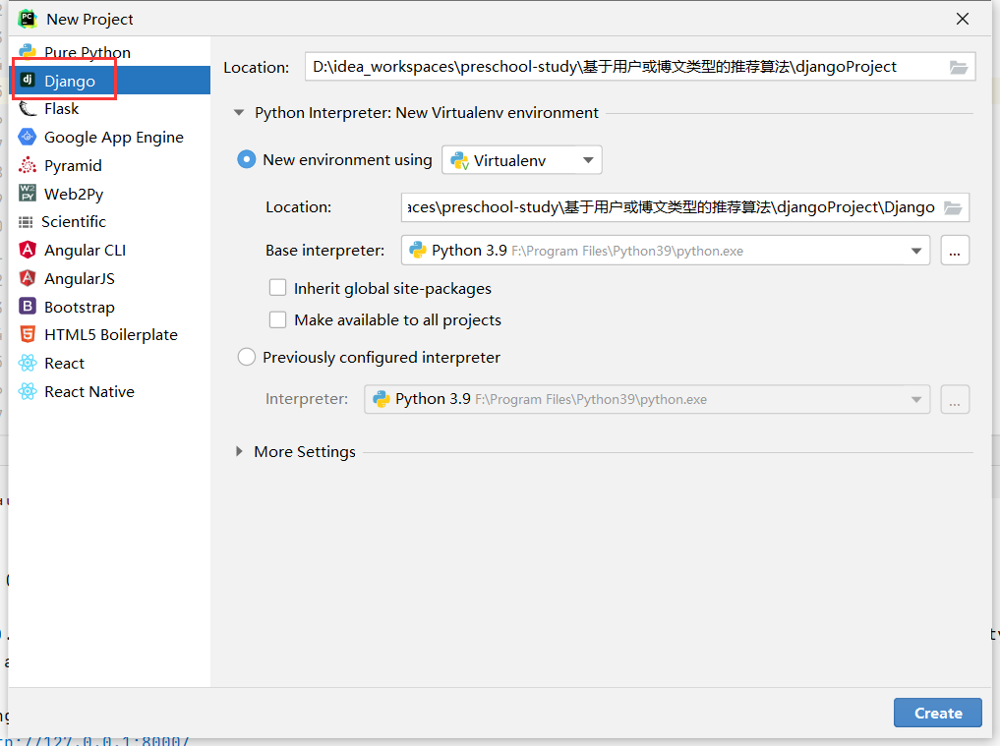
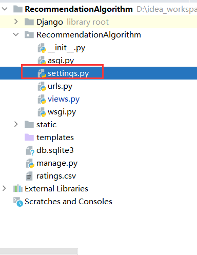

# 环境搭建

1. Python3环境配置

2. 所需工具包

   - pandas
   - numpy
   - pymysql
   - sklearn
   - jieba
   - django
   -  django-cors-headers（解决跨域问题）

3. 如果需要自己创建项目，可以看Pycharm选择创建django项目

4. 

5. 修改settings.py和我的一致（数据库账号修改为自己的）

   

6. 第2步之后，不出意外的话导入我的项目即可运行

# 基于用户的推荐算法

大体思路：根据用户的相似度，获得一个排行，取前五名的用户点赞和收藏的文章，按照出现的权重推荐给该用户。

相似度的定义：用户之间的点赞收藏的文章的相似度。

基于此

1. 后端需要新建收藏表和点赞表。
2. 当这个用户查看所有博文时，将该用户ID作为参数传递。然后py后台返回五个用户的ID给Java端，Java端再进行操作。
3. Java端需要生成的csv文件，就是所有用户的id，所有用户点赞和收藏的博文id，rating的值就是1。(可以考虑一个用户点赞和收藏一篇文章时，rating的值是2)。
4. 当数据集不多时，直接根据用户之间的收藏点赞的博文类型的相似度来推荐。
5. 当该用户没有收藏和点赞的文章时，默认普通的查询方式。

# 基于内容的推荐算法

等待实现

